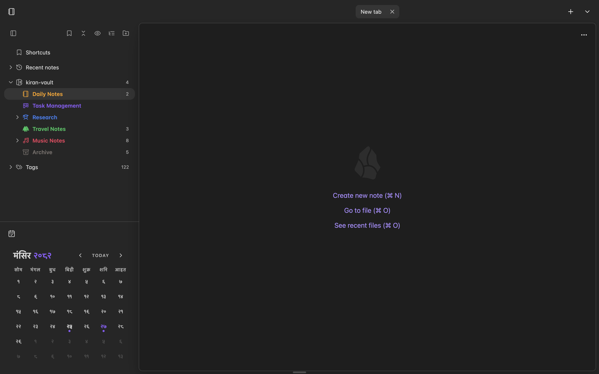

# Nepali Calendar for Obsidian

Hi there! 👋 This plugin brings the **Bikram Sambat (BS)** calendar system right into Obsidian. It's designed to help you manage your daily notes using Nepali dates, making it perfect for anyone who organizes their life around the BS calendar.

## Features

-   **Interactive Calendar**: A clean, native-feeling calendar view showing Bikram Sambat dates alongside Gregorian months.
-   **Daily Notes**: Click any date to open or create a daily note for that Nepali date. It works just like the core Daily Notes plugin but for BS!
-   **Day Details**: Long-press (500ms) any date to view comprehensive panchanga details including tithi, nakshatra, sunrise/sunset times, and more from the authentic miti.bikram.io API.
-   **Visual Cues**: See at a glance which days have notes (marked with dots) and easily spot today's date.
-   **Offline Support**: Calendar data is cached locally with intelligent preloading for seamless offline use.
-   **Customizable**: Choose your date format, note location, and start of the week.

## How to Use

1. **Open the Calendar**: Click the calendar icon 📅 in the ribbon or run "Open Nepali Calendar" from the command palette.
2. **Navigate**: Use the arrows to switch months or jump back to "Today".
3. **Manage Notes**: Click a day to open its note. If it doesn't exist, you'll be prompted to create it.
    - _Tip_: Ctrl/Cmd + Click opens the note in a new pane.
4. **View Day Details**: Long-press (click and hold for 500ms) on any day to see detailed panchanga information including:
    - Tithi, Paksha, Nakshatra, Yoga, Karan
    - Chandra and Surya Rashi (Moon and Sun signs)
    - Sunrise, Sunset, Moonrise, Moonset times
    - Ritu (Season) and other Nepali eras
    - Events and holidays

## Technical Architecture

This plugin uses the **miti.bikram.io API** for accurate Nepali calendar data with a smart caching strategy:

-   **Online**: Fetches fresh data from API and caches locally (30-day TTL)
-   **Offline**: Uses cached data or falls back to the bikram-sambat library
-   **Preloading**: Intelligently preloads surrounding months for smooth navigation

For more details, see [API_INTEGRATION.md](API_INTEGRATION.md) and [DAY_DETAILS_GUIDE.md](DAY_DETAILS_GUIDE.md).

## Installation

You can install this plugin directly from the Obsidian Community Plugins store (search for "Nepali Calendar").

Alternatively, for manual installation:

1. Download the latest release from GitHub.
2. Extract the files into your vault's `.obsidian/plugins/nepali-calendar/` folder.
3. Reload Obsidian.

---

_Enjoying the plugin? Feel free to report issues or suggest features on GitHub!_

## Acknowledgements

This plugin is heavily inspired by and based on the code from the [Obsidian Calendar Plugin](https://github.com/liamcain/obsidian-calendar-plugin) by [Liam Cain](https://github.com/liamcain). Huge thanks to Liam for the amazing work!
